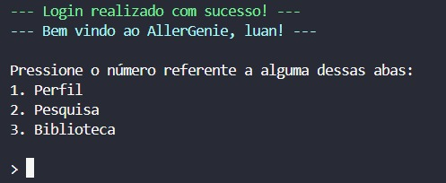
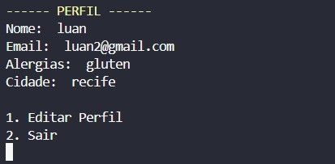

# AllerGenie

AllerGenie é um aplicativo voltado para pessoas com restrições alimentares, como alergias ou intolerâncias. O objetivo é proporcionar uma experiência segura e personalizada, conectando clientes a restaurantes que oferecem opções de pratos adequados para suas necessidades.

---

## 🌟 Funcionalidades

### 💼 Clientes

* Sistema completo de CRUD (Criar, Ler, Atualizar e Deletar conta)
* Pesquisa por:

  * Palavras-chave
  * Pratos
  * Localização
  * Restaurantes
* Opção de "Editar perfil" com os seguintes campos:

  * Alergias
  * Cidade

### 🏡 Restaurantes/Empresas

* Sistema completo de CRUD
* Opções no menu para:

  * Adicionar prato (nome, descrição, palavras-chave, preço)
  * Adicionar dados do restaurante (cidade, descrição, palavras-chave)

---

## 💻 Trechos de Código

Abaixo estão alguns exemplos representativos das principais funcionalidades do sistema:

### Avaliação de restaurante
Após uma pesquisa, é possível avaliar um restaurante, dando uma nota de 0-5. No final, se faz uma conta para descobrir a real media desse restaurante.

```python
  def avaliar_restaurante(restaurante):
    
    dados_restaurantes,_ = ler_dados_json()
    restaurante_encontrado = False
    for rest in dados_restaurantes:
        if rest['nome'].lower().strip() == restaurante.lower().strip():
            print(f'Qual nota deseja atribuir de 0-5 para o restaurante {restaurante}: ')
            avaliacao = float(input('> '))
            
            restaurante_encontrado = True
            if 0 <= avaliacao <= 5:
               
                rest["avaliacao"]["soma_avaliacoes"] += avaliacao
                rest["avaliacao"]["quantidade_avaliacoes"] += 1
                rest["avaliacao"]["media"] = (
                    rest["avaliacao"]["soma_avaliacoes"] / rest["avaliacao"]["quantidade_avaliacoes"]
                )
                CRUD.salvar_dados('bancos_json/restaurantes.json', dados_restaurantes)
                
                Utils.limpar_tela()
                print("----------------------------------------------------------")
                print(Utils.pinta(f'Avaliação de {avaliacao} atribuída com sucesso ao restaurante {restaurante}!.', 'verde-claro'))
                print("----------------------------------------------------------\n")
                
                pesquisa_cliente()

            else:
                print('Avaliação inválida. Deve ser entre 0 e 5.')
                
        if restaurante_encontrado:
            CRUD.salvar_dados('bancos_json/restaurantes.json', dados_restaurantes)
```

O JSON fica organizado dessa maneira
```JSON
 {
        "nome": "carlitos@gmail.com",
        "email": "carlitos@gmail.com",
        "senha": "51201ebd0f3464e91b086ae4cf6981cdd221e92c54670dcfcd623e5112c7f5a1",
        "id": "2311928812528",
        "cnpj": "Não cadastrado.",
        "avaliacao": {
            "media": 0.0,
            "soma_avaliacoes": 0,
            "quantidade_avaliacoes": 0
        }
```

### Visualizar/Adicionar comentários
É possível olhar comentários feitos por outros usuários, além de adicionar um comentário ao restaurante

```python
def visualizar_cometarios(restaurante):
    banco_comentarios = CRUD.atualizar_dados('bancos_json/comentarios.json')

    # Verifica se o restaurante está dentro do banco de comentários
    if restaurante in banco_comentarios:
        print(f'\nComentários para o restaurante {restaurante}\n')
        print("----------------------------------------------------------")
        comentarios_restaurante = banco_comentarios[restaurante]

        for usuario, comentarios in comentarios_restaurante.items():
            print(f"Usuário: {usuario}")
            for comentario in comentarios:
                print(f"- {comentario}")
            print("----------------------------------------------------------")

    else:
        print(Utils.pinta(f"\nAinda não há comentários para o restaurante '{restaurante}'.\n", 'vermelho_claro'))
        while True:
            print('Deseja fazer o primeiro comentário nesse restaurante?\n1. Sim \n2. Não (Retorna para o menu de pesquisa)')
            opc = input('> ').strip()

            if opc == '1':
                fazer_comentario(restaurante)
                break  # Sai do loop após fazer o comentário
            elif opc == '2':
                pesquisa_cliente()
                break  # Sai do loop após retornar
            else:
                print('\nOpção inválida. Digite 1 para Sim ou 2 para Não.\n')

    # Repetição até digitar uma opção válida
    while True:
        print('Deseja fazer um comentário nesse restaurante?\n1. Sim \n2. Não (Retorna para o menu de pesquisa)')
        opc = input('> ').strip()

        if opc == '1':
            fazer_comentario(restaurante)
            break  # Sai do loop após fazer o comentá rio
        elif opc == '2':
            pesquisa_cliente()
            break  # Sai do loop após retornar
        else:
            print('\nOpção inválida. Digite 1 para Sim ou 2 para Não.\n')


def fazer_comentario(restaurante):
    dados_usuarios_temp = CRUD.atualizar_dados('bancos_json/clientes.json')
    
    print("Digite seu email (será utilizado para encontrar seu nome de usuário):\n")
    email = input('> ').strip()

    nome_usuario = None

    # Procura o nome do usuário com base no email
    for usuario in dados_usuarios_temp:
        if usuario.get('email') == email:
            nome_usuario = usuario.get('nome')
            break
 
    # Se o email não for encontrado
    if not nome_usuario:
        print("Email não encontrado.\n")
        return

    # Entrada do comentário
    while True:
        print(f"Digite seu comentário, {nome_usuario}: ")
        comentario = input('> ').strip()

        if len(comentario) == 0:
            print("\nComentário não pode ser vazio. Tente novamente.\n")
        else:
            break  # Comentário válido

    # Atualiza os comentários do JSON
    comentarios = CRUD.atualizar_dados('bancos_json/comentarios.json')

    # Se o restaurante ainda não tem comentários, cria a chave
    if restaurante not in comentarios:
        comentarios[restaurante] = {}
    if nome_usuario not in comentarios[restaurante]:
        comentarios[restaurante][nome_usuario] = []

    # Adiciona o comentário ao usuário
    comentarios[restaurante][nome_usuario].append(comentario)

    # Salva os comentários atualizados
    CRUD.salvar_dados('bancos_json/comentarios.json', comentarios)

    Utils.limpar_tela()
    print(Utils.pinta("Comentário adicionado com sucesso!", 'verde_claro'))

```
## 📸 Exemplos Visuais

### 🔐 Tela de Menu do Cliente


### 🔐 Tela de Visualização de Perfel do Cliente


### 🔐 Tela de Pesquisa do Cliente


## 📄 Estrutura do Projeto

O sistema é desenvolvido em Python e armazena os dados dos usuários (clientes e restaurantes) em arquivos `.json`. Isso inclui informações de perfil, cardápios e filtros de pesquisa.

---

## 📖 Bibliotecas

### 🔐 `pwinput`

* **Descrição:**
  Biblioteca para capturar senhas ou entradas de forma oculta no terminal. Excelente para proteção de dados sensíveis.

* **Instalação:**

  ```bash
  py -m pip install pwinput
  ```

* **Exemplo:**

  ```python
  import pwinput
  senha = pwinput.pwinput("Digite sua senha: ")
  ```

---

### 🧮 `hashlib`

* **Descrição:**
  Biblioteca usada para criptografar dados (como senhas) usando algoritmos de hash como SHA-256. Ajuda a proteger informações sensíveis.

* **Instalação (caso necessário):**

  ```bash
  py -m pip install hashlib
  ```

  Obs: `hashlib` já está incluído por padrão no Python.

* **Exemplo:**

  ```python
  import hashlib
  senha = "minha_senha123"
  hash_senha = hashlib.sha256(senha.encode()).hexdigest()
  print(hash_senha)
  ```

# 📊 Fluxogramas do Projeto

Este projeto possui diversos fluxogramas criados para ilustrar e organizar o fluxo de funcionalidades principais. Abaixo estão os links para acesso rápido a cada um deles no Miro:

## ✅ Página Inicial
🔗 [Acessar fluxograma](https://miro.com/app/board/uXjVI1VTWdY=/?share_link_id=363574602305)

## ✅ Create Empresa
🔗 [Acessar fluxograma](https://miro.com/app/board/uXjVI1VAO8I=/?share_link_id=41309087508)

## ✅ Create Cliente
🔗 [Acessar fluxograma](https://miro.com/app/board/uXjVI0UP6_A=/?share_link_id=73213188831)

## ✅ Login
🔗 [Acessar fluxograma](https://miro.com/app/board/uXjVIvukS1k=/?share_link_id=246721087919)

## ✅ Menu Restaurante
🔗 [Acessar fluxograma](https://miro.com/app/board/uXjVIvG45zE=/?share_link_id=148354674661)

## ✅ Menu Cliente
🔗 [Acessar fluxograma](https://miro.com/app/board/uXjVIvu0y1g=/?share_link_id=842835422224)

## ✅ Pesquisa
🔗 [Acessar fluxograma](https://miro.com/app/board/uXjVIvGquwY=/?share_link_id=880846900225)


## 📂 Link Alternativo: Fluxogramas no Google Drive

Se preferir, você também pode acessar todos os fluxogramas diretamente pelo Google Drive:

🔗 [Acessar pasta com os fluxogramas no Drive](https://drive.google.com/drive/folders/1v_Ecn46yD4etBd9W9wpEXHmRZ9VWXDsR?usp=sharing)

## ℹ️ Observação
Todos os fluxogramas são de visualização pública via Miro e Google Drive, garantindo fácil acesso para consulta e colaboração.


Feito por Carlos Batista e Luan Marcos<br>Sistemas de Informação - UFRPE
